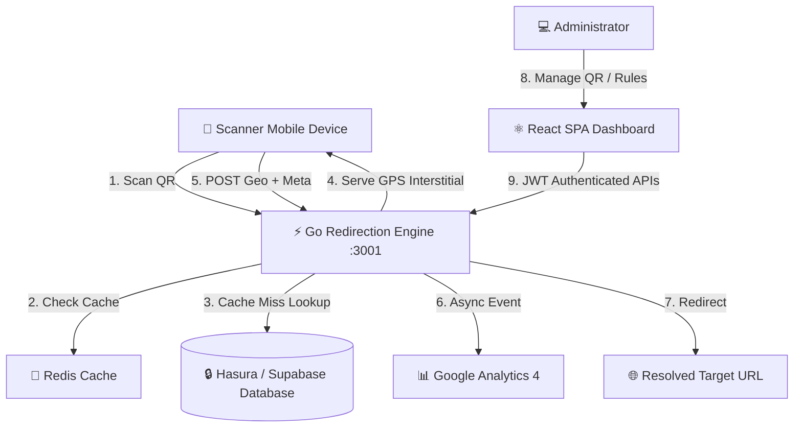

# chroniQR

> **Precision Dynamic QR Redirection & Scanner Analytics Platform**
> 
> *Engineered UI. Sub-millisecond routing. Rich multi-channel destinations.*

---

**chroniQR** is an enterprise-grade dynamic QR platform designed with a high-contrast terminal-inspired aesthetic. It allows users to generate, configure, and manage dynamic QR codes that change their destinations on-the-fly. Powered by a Go-based redirection engine with Redis caching, chroniQR resolves scanner routing rules under sub-millisecond response times, while capturing precise client metadata and GPS-level scanner analytics.

---

## 🧭 Core Philosophy & Design Language

chroniQR follows a strict **Machinist Blueprint & Precision Digital** UI design system:
- **Aesthetics:** Technical, dark-mode-first layout optimized for glowing accents.
- **Contrast & Radii:** Rounded borders strictly restricted to `6px` for interactive nodes and `12px` for main panels. Zero pill-shaped buttons.
- **Harmonious Palette:** 
  - Backgrounds: `#000000` (Absolute Black) & `#0A0A0A` (Card Gray)
  - Accents: `#CCFF00` (Voltage Lime) & `#2ECA45` (Success Green)
  - Text: `#EDEDED` (Off-white reading text) & `#A1A1AA` (Zinc secondary)
- **Typography:** Sans-serif fonts (Geist, Inter) for interface hierarchy paired with monospace typography (Geist Mono, JetBrains Mono) for numerical data, slugs, scan counts, and UUIDs.

---

## ⚡ Key Features

### 1. Dynamic, Time-Based Routing Engine
Create rule-chains that evaluate scanner local times against active schedules to determine the redirect destination.
- **Timezone Aware:** Evaluates routing rules in the creator's configured timezone.
- **Day-of-Week Matching:** Restrict links to specific working days (e.g., Mon–Fri).
- **Time Windows:** Define active hours (e.g., `09:00` to `17:00`).
- **Midnight Spanning Support:** Seamlessly handles overnight windows (e.g., `22:00` to `03:00`).
- **Ordered Evaluation:** Rules are processed sequentially; the first match wins, falling back to a default destination.

### 2. Multi-Channel Rich Destinations
Go beyond basic URL redirection. chroniQR natively handles:
- **Website URL:** Redirects with automatic forwarding of inbound UTM query parameters.
- **WhatsApp Message:** Formats numbers and pre-populates templates (`https://wa.me/{phone}?text={message}`).
- **AI Voice Call:** Serves a custom voice CTA landing page (`tel:{number}`) or desktop call-back form.
- **Email Prompt:** Triggers mail client drafts with subject/body presets (`mailto:{to}?subject={subject}&body={body}`).
- **vCard Contacts:** Generates virtual contact cards (`.vcf`) for instant phone address book downloads.

### 3. Precision Geolocation & Client Metadata Interstitial
For dynamic redirects, the redirect handler serves an intermediate script that gathers client-side telemetry via HTML5 browser APIs:
- **GPS Coordinates:** Latitude and longitude coordinates (with user permission).
- **Client Metadata:** Screen resolution, timezone, language, platform, connection type, cookie support, and pixel ratio.
- **Fail-Safe Timeout:** Redirects to target destination after 3 seconds even if permission is delayed or denied.

### 4. High-Performance Redirection Engine
- **Single-Flight Cache Stampede Protection:** Uses single-flight caching with Redis (60s TTL) so concurrent scan bursts collapse onto a single database lookup instead of overloading your system.
- **Analytics Attribution:** Integrates with GA4 Measurement Protocol to fire asynchronous, non-blocking pageview/scan events with decryted GA4 credentials.

---

## 🏗️ Architecture & Tech Stack



### Frontend
- **React 19** & **TypeScript**
- **Vite** (Build tool & development server)
- **Supabase JS Client** (Auth state, JWT token generation)
- **Vanilla CSS Layout** (Engineered to match `design.md`)
- **Lucide React** (Vector iconography)

### Backend
- **Go** (Golang REST API / Redirect Handler)
- **Supabase Auth** (Bearer JWT validation)
- **Redis** (Lookup caching and single-flight lock)

---

## 📂 Project Structure

```text
chroniQR/
├── .agents/                 # AI workspace profiles & instructions
├── public/                  # Static assets
├── src/
│   ├── assets/              # SVG vectors and design assets
│   ├── components/          # Reusable dashboard components
│   │   ├── AnalyticsView.tsx   # Detailed chart analysis and GPS locations
│   │   ├── AuthScreen.tsx      # High-contrast login/signup container
│   │   ├── LandingPage.tsx     # Hero page showcasing core capabilities
│   │   ├── Navbar.tsx          # Global navigation bar
│   │   ├── QrCard.tsx          # Dynamic QR matrix and actions grid
│   │   ├── QrForm.tsx          # Destination selector and routing builder
│   │   ├── SettingsView.tsx    # Workspace settings (GA4 keys)
│   │   ├── StatsGrid.tsx       # Mini dashboard telemetry counters
│   │   └── TimeRuleBuilder.tsx # Sequential rule drag/drop configurator
│   ├── utils/               # Network utility helper scripts
│   │   ├── api.ts              # Fetch requests with JWT headers
│   │   ├── auth.ts             # Supabase session handlers
│   │   ├── routingPreview.ts   # Client-side time evaluator
│   │   └── supabaseClient.ts   # Core client init
│   ├── App.tsx              # Main entry routing logic
│   ├── index.css            # Precision UI style framework tokens
│   └── main.tsx             # React entrypoint
├── index.html               # Main index file
├── package.json             # NPM project definitions
├── vite.config.ts           # Vite configurations
└── design.md                # System UI guidelines
```

---

## 🛠️ Configuration & Local Setup

### 1. Prerequisites
- **Node.js** (v18+)
- **Go** (v1.20+)
- **Redis** (running locally on port 6379, optional but recommended for backend)

### 2. Environment Variables (`.env`)
Create a `.env` file in the root directory:
```env
VITE_SUPABASE_URL=https://your-supabase-project.supabase.co
VITE_SUPABASE_ANON_KEY=your-anon-public-key
VITE_BACKEND_URL=http://localhost:3001
```

### 3. Frontend Installation
```powershell
# Clone the repository
git clone https://github.com/your-username/chroniQR.git
cd chroniQR

# Install packages
npm install

# Start Vite Development Server
npm run dev
```

### 4. Running the Go Backend
Ensure your Go backend (located in your sibling directory or as part of the orchestration) is configured to bind to port `3001` and connects to the same Supabase Postgres database.

---

## 🌐 API Route Specifications

| Method | Endpoint | Description | Auth Required |
|:---|:---|:---|:---|
| **GET** | `/api/qr` | List all current QR configurations | Yes (Bearer JWT) |
| **POST** | `/api/qr` | Create a new dynamic QR code | Yes (Bearer JWT) |
| **PUT** | `/api/qr/:id` | Update an existing configuration / rules | Yes (Bearer JWT) |
| **DELETE** | `/api/qr/:id`| Permanent deletion of a QR code | Yes (Bearer JWT) |
| **GET** | `/api/scans/count` | Retrieve aggregated scan statistics | Yes (Bearer JWT) |
| **GET** | `/api/scans` | Query scan logs by `qr_id` | Yes (Bearer JWT) |
| **POST** | `/api/scan-location` | Receive client-side device info and GPS | No |
| **GET** | `/:short_code` | Resolve dynamic redirect to target destination | No |

---

## 🤝 Contributing

Contributions are welcome! Please follow these guidelines:
1. Ensure all styles align with the grid system in `design.md`.
2. Do not use soft drop shadows or pill buttons.
3. Write clean, documented React hooks and components.
4. Ensure code passes all TypeScript compiler validations (`npm run build`).

---

*chroniQR — Built with absolute precision.*
